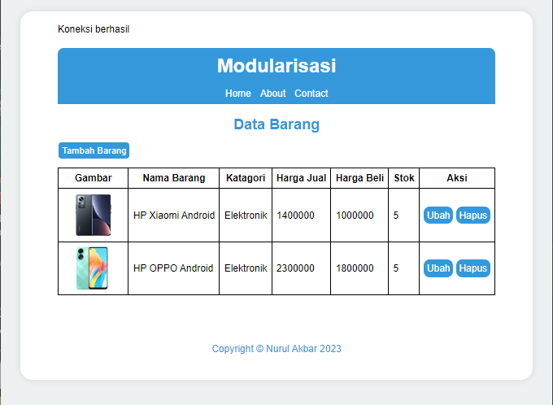
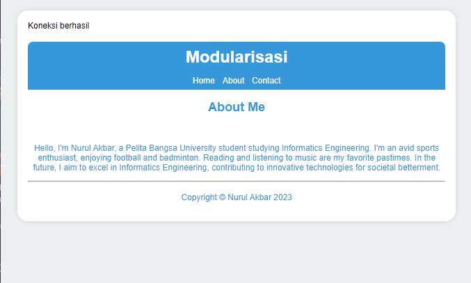
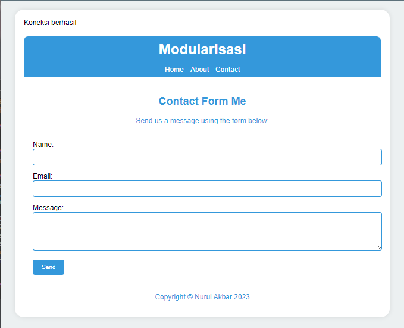

# **Lab 9 Web**

```
Nama    : Nurul Akbar
NIM     : 312210413
Kelas   : TI.22.A4
```

## **Instruksi Praktikum**

1. Persiapkan text editor misalnya VSCode.
2. Buat folder baru dengan nama lab9_php_modular pada docroot webserver
   (htdocs)
3. Ikuti langkah-langkah praktikum yang akan dijelaskan berikutnya.


## **Langkah Langkah Praktikum**


1. Buat file baru dengan nama `header.php`

```php
<!DOCTYPE html>
<html lang="en">
<head>
    <meta charset="UTF-8">
    <title>Contoh Modularisasi</title>
    <link href="style.css" rel="stylesheet" type="text/stylesheet"
media="screen" />
</head>
<body>
    <div class="container">
        <header>
            <h1>Modularisasi Menggunakan Require</h1>
        </header>
<nav>
    <a href="home.php">Home</a>
    <a href="about.php">Tentang</a>
    <a href="kontak.php">Kontak</a>
</nav>
```

2. Buat file baru dengan nama `footer.php`

```html
            <footer>
                <p>Copyright &copy; Nurul Akbar 2023</p>
            </footer>
        </div>
    </body>
</html>
```

3. Buat file baru dengan nama `home.php`

```php
<?php require('header.php'); ?>
<div class="content">
```

4. Buat file baru dengan nama `about.php`

```php
<?php require('header.php'); ?>
    <div class="content">
        <h2>Ini Halaman About</h2>
        <p>Ini adalah bagian content dari halaman.</p>
    </div>
<?php require('footer.php'); ?>
```

5. Buat file baru dengan nama `kontak.php`

Script :

 ```php
<?php require('header.php'); ?>
    <div class="content">
        <h2>Ini Halaman Kontak</h2>
        <p>Ini adalah bagian content dari halaman.</p>
    </div>
<?php require('footer.php'); ?>
```
## **Tugas**
Implementasikan konsep modularisasi pada kode program praktikum 8 tentang
database, sehingga setiap halamannya memiliki template tampilan yang sama. 

## **Output**




